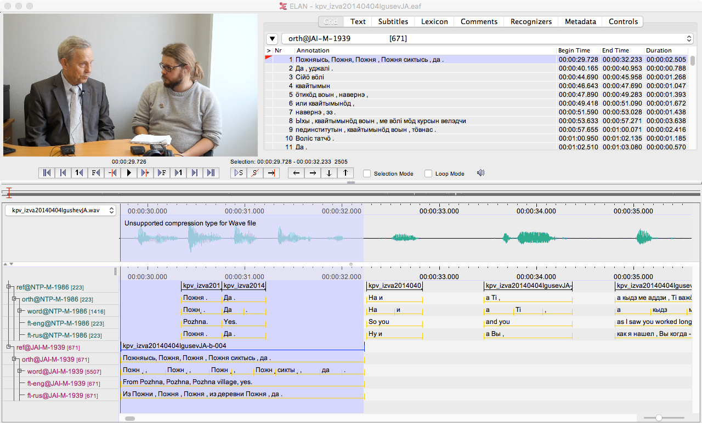
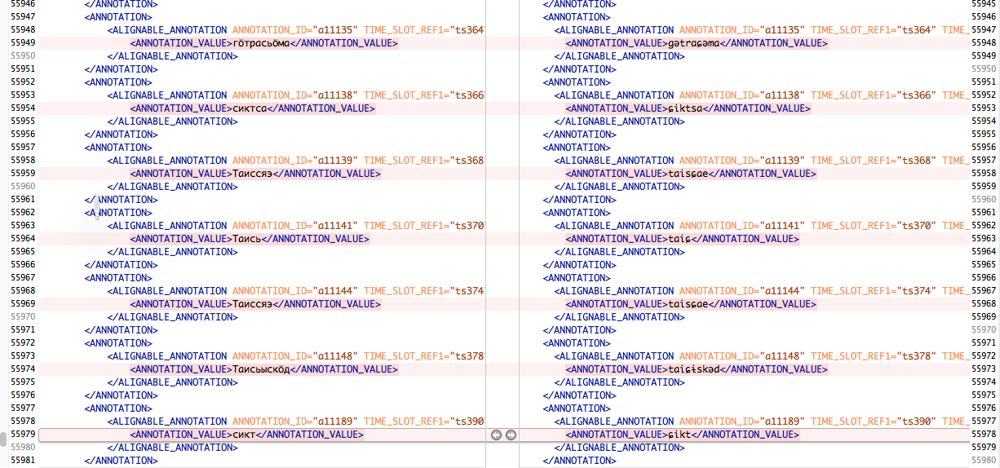

# Theory and Method

## Theory

My study falls within variationist sociolinguistics, and the variable under investigation is very traditional as it is phonetical. I've tried to keep the analysis section very uncomplicated, especially since I'm rather new on this field. There are two annotated variants and all occurrences in the corpus are taken into account, although the more standard Komi pronunciation is overwhelmingly the most common in data. I have not found occurrences where the realization of the variable could be zero, so I'm quite confident I've captured all occurrences in my annotations. I have described the procedure how variables are selected in section \@ref(ELAN-model) about ELAN annotations. It is also assumed that these variants are functionally equivalent, so that there are no obvious differences in meaning. This variable is also good for investigation as it is very common -- palatal sibilants are very typical phonemes in the Permic languages and thereby occur in basically any text. The choice of variable was very much influenced by the procedure described by Tagliamonte [-@tagliamonte2006a, p. 70-]

Parts of the region studied are under the influence of Komi written standard, but in the peripheric regions Komi is not widely teached, and if it is, the variety is often the local dialect. This has impact to how conscious the individuals are about the norms of the standard language [@milroyEtAl1997a, 75] <!-- Note to self: double check this article for more -->. There have been earlier reports about the spread of standard language variants within Komi Republic, especially within lexical items. However, Cypanov also mentions his observations how also at the Komi countryside the standard language would be connected to the speakers' educational level, but at the same time in some regions (Luza, Udora and Iźva being listed as examples) the local dialects also compete with the literary standard in their value and authority. [@cypanov2009a, p. 215]. <!-- This sounds exactly like the process described by Milroys where 'vernacular maintenance' competes with the standard [other Milroy, add to bibliography p. 53].-->So the institutional endorsement of standard is present for some local varieties only, which is salient in the sense that also the local dialect embracement can be seen as a reaction to the standardization demands. If it is a counterreaction, it may not be similarly present in the areas where the original catalyst for it is missing.

It must also be taken into account that the variation within endangered language may not be entirely as expected from larger languages. Lyle Campbell has even recently suggested that the variation within endangered languages may not even be regular [@campbell-l2016a, p. 257-259]. Campbell gives examples from several languages, and it seems clear that for example the variation in the speech of semi-speakers may not fit any regular pattern. The process likely has something to do with the fragmentation of community which seems to be taking places in many language endangerment situations. We wrote recently about this with Janne Saarikivi [@partanenEtAl2016a], and our investigation of the social networks in a fixed neighbourhood shows clearly that the assumptions of who is Karelian speaker are getting very detached from the actual reality of who would be a speaker, and the language ends up being used in very closed and heterogenous groups which are not aware about each others. The language acquisition and use takes place in these micro-networks within the larger community, which makes it not surprising if the patterns in speech are not very logical community wide. Maybe instead of irregularity the factors influencing the language use have just became too complex and fragmented to be easily studied? Already some fifteen years ago Heikki Paunonen has commented that *"overflowing variation is a sign of crisis in the language community"* [@paunonen2000a], and probably one could trace down more comments along these lines in the literature. 

## Methodological implementation

Methodology always has two aspects -- scientific and technical. The first is about what do we want to do, and the latter deals with how do we do it. In principle the ideal technical framework would allow us to focus only to the scientific side, as that is where the linguistic questions are being formulated and solved. However, although in principle there are many branches of linguistics which do not demand concrete access to the data, it is also very common and sound to base the conclusions into actual occurrences of something somewhere. While dealing with the annotation layers to work with, in practice we almost inevitably have to settle to something that is not perfect, but allows us to get the work done. I'm personally quite strict with this, and having some programming background, I'm very reluctant to get into manual labour which I see computer could perform better, faster and more reliably. However, I think it is very important to identify what are those parts where manual labour is needed and valuable, and built the workflow so that the possible manual strain would be on exactly those sections where human input matters.

There are many workflows surrounding sociolinguistic data, for example, one suggested by Nagy and Meierhof [-@nagyEtAl2015a]. I'm suggesting something very much in that strain, but with the difference that this model is, as I see it, more reliable and easy to maintain. The workflow they describe is still very much centered with exporting files, whereas I would see this as most of the time unnecessary step, since the data we want to deal with is already very well presented in the files we have in the beginning. Parsing this data directly to our analysis has the benefit that the changes in data are immediately present in the further results.

In many ways it is often possible to imagine ideal workflow. However, as important as this is, one also has to realize the limitations which may make this unrealistic. A very common issue is that the current tools we have do not allow fast enough annotation if the annotations have to be fit into a very byzantine and complex data structures. Also the problem tends to arise that even though creating annotations now would work, there can be some problems which occur later when the annotations are edited, realigned and corrected.

It is possible to delineate following principles:

- One piece of information should be written only once
- Data should be interconnected in the way that relations between different units can be reconstructed (this doesn't need to be simple or straightforward, but these relations have to exist one way or another in machine readable format. More the connections are documented, the better.)
- Working with annotations should be relatively rapid and effortless

In reality one has to balance between these principles. Of course one could argue that the last one is easiest to cut from, but the case is not so straightforward, as it has direct impact to the working hours spent which eventually comes into the number of occurrences in the corpus. This is especially important if more statistical methods are employed, for which it may be reasonable to have several parallel datasets used for testing different hypotheses. If data editing is extremely tedious, then it becomes much less feasible that the data is treated as would be the most suitable. And all this kind of boils down to the fact:

- There has to be a long-term data curation plan where these study-specific annotations fit

Even though some annotations would be done just for one study, there is no reason they should be separated from the rest of the corpus. However, they should be added to the corpus in a way which doesn't demand extra work from normal data curation. This means that they should not be too fixed to the current values, for example, they should not assume that elements such as tokens are immutable.

## Reproducibility

By saying that my study is reproduceable I do not claim that my results are necessarily correct. I only mean that the others can verify what I have done and evaluate it with the data I have used. Ideally the study results would be repeated with a different dataset, which would in many ways be actually desired, since that would immediately add credibility to my ideas presented here. As reproducibility is a rather new concept in linguistic sciences, there seems to be quite a bit of confusion over the terms **reproduction**, **replication** and **independent verification**. Biostatistician Roger Peng has written very clearly about this in [Simply Statistics blog](http://simplystatistics.org/2014/06/06/the-real-reason-reproducible-research-is-important/) [@peng2014a].

The study follows logic not particularly unusual for a scientific study: a phenomena has been observed and found interesting after further contextualization. A further study was planned in order to find out what it is about, so a corpus sample has been selected and annotated. These annotations are analyzed and the results are interpreted against the ideas that arose after the initial observation and contextualisation. The analysis part is mainly within the \@ref(conclusions) Conclusions section of this study.

## Archiving

The corpus files are archived in The Language Archive of Nijmegen Max Planck institute. They are organized under the node **Permic_Varieties/kpv/**. In the archive structure all sessions are treated as entities on same hierarchy level. This may seem confusing, but the idea is that one has to consult metadata in order to know into which project and working group which session is connected. It would had been customary to organize data by **academic projects**. However, this model becomes problematic when the same data has been collected, transcribed, digitalized, reanalyzed and archived by totally disconnected people often many decades apart from one another. Thereby the only model to arrange these files in an honest manner is to list in metadata all relevant actors and projects involved.

In the archive there has been an attempt to maintain rough dialect division, so that the files would be named by prefixes marking different varieties. This is also complicated topic, as same recording contains often data from speakers of different dialects. Individual speakers have often been very mobile, so they also can have mixed features in their everyday speech. As many other good ideas, also this dialect based file naming has been somewhat futile.

The subcorpus used in this study today, `r Sys.Date()`, may not be connected to those files the archive contains in whatever future date this study is being read. However, this study refers explicitly to those file versions which were valid and accessible at the time when this document was compiled.

## ELAN annotations {#ELAN-model}

The ELAN annotation model used in the corpus is relatively simple, the data being set on different layers which correspond to specific time-aligned utterances. This means that for one Komi utterance there are often different data layers, for example, Russian translation, English translation or comments. Also tokenized data layer is provided, but the tokenized units are not connected to the recording itself.

For this study a new layer is added on which the tokens containing sibilants are time aligned and transcribed in IPA. This has been done by copying the token containing tier, filtering out the tokens which do not contain palatal sibilants and time aligning the remaining word forms.

The steps taken have been:

- Copying tier of symbolic subdivision type which contains the tokens into tier of included in type
- Filtering the sibilant containt forms with regular expression  `^((?!зь)(?!зё)(?!зя)(?!зю)(?!зи)(?!зе)(?!сь)(?!сё)(?!ся)(?!сю)(?!си)(?!се)(?!Зь)(?!Зё)(?!Зя)(?!Зю)(?!Зи)(?!Зе)(?!Сь)(?!Сё)(?!Ся)(?!Сю)(?!Си)(?!Се)(?!тс)(?!ст)(?!Ст).)*$`, which selects everything that can't contain a feature I am interested, and replacing it's result with an empty string
- Using ELAN's **Remove annotations or values** tool to remove all annotations on this tier when they contain an empty annotation

With this workflow we get from this:



To this, which can relatively easily be time aligned:


The transcription system used is described in section \@ref(transcription-system). about transcription systems.

This means that an utterance:

```{r, echo=F}

gloss <- sle2016partanen::add_gloss("пукав да сёй!",
          "Sit.down.IMP and eat.IMP",
          "Sit down and eat!")
```

`r gloss`

Would be transcribed on the sibilant annotation tier as:

>  ɕoj or sʲoj

This is not a perfect method, but the best I was able to come up within the rationale and limitations explained above.

Now there is still quite much manual work in translitteration to phonemic IPA, aligning everything and identifying the necessary phonetic adjustments. Thereby I wrote a small function which does the transliteration. The screenshot below illustrates the changes it does inside ELAN file:



After this each token on sibilant tier is manually aligned and evaluated. This is relatively time consuming phase, but in many ways it is also the most important one. The whole study is in the end about these variables, so spending most of the time with analysing them is indeed quite appropriate. What I've tried to reach in this workflow is state where minimal amount of time is spent in rather unimportant manual tasks, and thereby what really matters gets the time it deserves. In the end automated workflow also makes it possible to reach relatively large sample within the current time frame. Although time is not really the most pressing issue, our daily working hours are in the end always limited.

### Caveouts of the current annotation model

The problem with the current model is that it is pretty manual and the annotated sibilant containing forms are not strictly connected to the corresponding tokens within the utterances. The main reason to this is that I want the sibilant annotated tokens to remain independent from further changes in the main transcription.

It is also somewhat problematic that the actual annotation is usually done in a longer time span and the exact method may be refined. For example, one may realize later a context which should had been taken into account in the regular expression. This leads to a change which is automatically implemented in the further files, but must be manually carried out in older files. This is not a huge problem in itself, but it means that the workflow is easily not as reproduceable and automatic as it may seem.

## Automated processing with R

In order to retrieve the sibilant information from ELAN files an R package `FRelan` is used. It contains several functions for parsing data from ELAN files to a data frame, which is an R internal tabular format which works rather well for data like this. Each token forms its own row. This data frame is merged with metadata which contains biographical and geographical information about, for example, about the speakers themselves and the time and place related information about the context where the utterance was recorded.

The variables relevant for my analysis are:

* Age of the speaker
* Birthplace of the speaker
* Place of residence of the speaker
* Recording time
* Recording setting (formal, informal)
* Education of the speaker

These variables are compared to the frequency of different sibilant allophones.

## Praat

Most of the time the distinction between these allophones is relatively easy to hear. However, I have used Praat in many cases to establish the baseline for these features, and also to validate whether some cases are as complex as they sound like.

## Statistical analysis

Statistical methods have not been widely employed within Uralic studies, although sociolinguistics has been practised in different forms. However, for whatever reasons variationistic studies have not been very common. There are naturally exceptions, for example Niina Kunnas's study of word final vowels in Karelian [@kunnas2007a] falls comfortably to this framework. Within wider perspective of sociolinguistics Sali Tagliamonte gives quite nice overview in her recent book [-@tagliamonte2016a, p. 107] about the history of statistical methods on this field. She refers to her interview with David Sankoff, with the observation that within sociolinguistics the data generally tends to be messier and more complicated than on many other scientific fields where statistical methods are regularly employed. Later the discussion turns into the fact how ultimately one has to be familiar with the dataset used, and I also  However, inevitable conclusion is that one has to employ some statistical tools in order to verify, and also often to find, the patterns in the data. 

While discussing the use of statistical tools with different researchers one gets often impression that there is not always that clear idea about their use. This is very understandable. As I mentioned, the statistics have not been used that much in Uralistics. However, they are often demanded by reviewers or scientific boards. I've heard countless of anecdotes about situations where the statistical tests just have been made because they have to be made. On the other hand, one finds at times something that could be described as blind faith in statistics. Small data, stange ideas -- no problems, just make the calculations (or let computer do them). 

I'm just trying to navigate in these waters myself and to find my own position. As far as I see it, the statistics kind of inevitably come into play when we want to make claims about numeric occurrences of something somewhere. The patterns and frequencies aren't something we can outline just by looking into data, especially when the amount of data starts to be big enough. Statistics can often tell us whether something really occurs, but they don't do very much to explain *what does it mean* or *why does it happen*. However, the latter questions are also impossible to answer before it is ascertained that the feature is actually there and it has some pattern.

The variable I'm investigating fits well into this framework, as there is part of the variation which seems to pattern easily with very traditional statistical tests. One pattern like this is geography. However, in order to contextualize the occurrences better one has to look into the ideologies, stylistic practises and individual agency of the speaker, which sets the study more into the the third wave of sociolinguistic research outlined recently by Eckert [-@eckert2012a].
